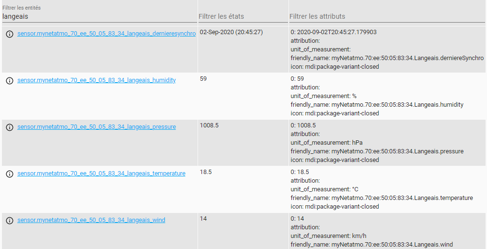

# apiNetatmo
apiNetatmo vous permet de recuperer les informations des stations favorites de votre compte NetAtmo

1. Installer composant manuellement ou ajouter le repo via HACS
2. Se créer un compte sur https://dev.netatmo.com/ et se créer une app
3. Ajouter le sensor suivant dans votre configuration home assistant:


```yaml
- platform: apiNetatmo
  username : <votreusername>
  password : <votrepassword>
  code: <clientId>
  token: <clientSecret>
  host: <une des adresse mac d'un de vos favori>
  scan_interval: 600
```


Chaque favori netatmo va creer les sensors selon le type de sensor netatmo( temperature, vent, humidite etc..


